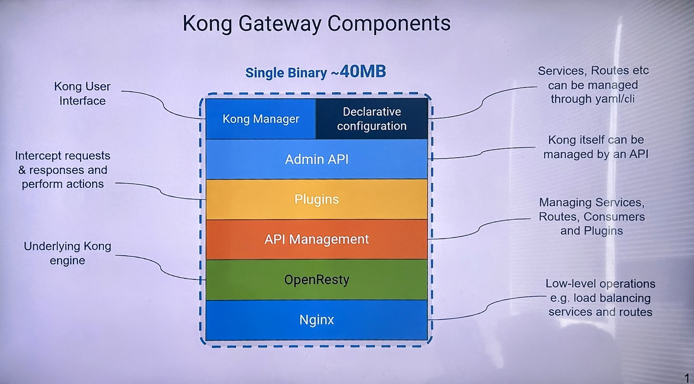

# Architecture

## Table of Contents
1. [Introduction](#introduction)
2. [KONG Gateway Architecture Overview](#kong-gateway-architecture-overview)
3. [KONG Gateway Components](#kong-gateway-components)
   - [Kong Manager](#kong-manager)
   - [Declarative Configuration](#declarative-configuration)
   - [Admin API](#admin-api)
   - [Plugins](#plugins)
   - [API Management](#api-management)
   - [OpenResty](#openresty)
   - [Nginx](#nginx)
4. [KONG Gateway Flow](#kong-gateway-flow)
5. [Deployment Models](#deployment-models)
6. [Conclusion](#conclusion)

## Introduction

The KONG API Gateway is an open-source, scalable platform that provides an interface to manage and secure APIs and microservices. It is designed to handle both internal and external API traffic and support high-performance, real-time, and secure transactions. This document provides an in-depth view of the KONG Gateway's architecture, detailing its key components, their interactions, and deployment patterns.

## KONG Gateway Architecture Overview

KONG Gateway is built as a single binary package, with a lightweight footprint (~40MB), making it easy to deploy and manage across diverse environments. It utilizes **Nginx** and **OpenResty** to handle high-performance and low-latency API requests, providing functionalities for traffic management, authentication, and data handling through its modular, extensible architecture.

KONG’s architecture is divided into layers, each responsible for different tasks:
1. **Kong Manager & Declarative Configuration**: The User Interface and configuration management.
2. **Admin API & Plugins**: API administration and extension capabilities.
3. **API Management Layer**: Core management functionalities for routing and policy enforcement.
4. **Underlying Infrastructure**: Built on OpenResty and Nginx for low-level network operations.

The following sections describe each component in detail, from the user interface and API management layers to the core server components that drive KONG’s performance.

## KONG Gateway Components

### Kong Manager
- **Purpose**: Kong Manager is the graphical user interface (GUI) for KONG, which allows users to manage API resources, view logs, monitor API usage, and configure settings.
- **Functionality**: Users can interact with Kong Manager to configure services, routes, consumers, and plugins visually. It serves as the main control interface for managing the gateway without direct interaction with the CLI or declarative files.

### Declarative Configuration
- **Purpose**: Provides an option for **configuring services, routes, and plugins using YAML** or **JSON** files, enabling the management of KONG's state through a version-controlled, declarative approach.
- **Functionality**: By using declarative configuration files, users can define and manage all components of KONG in a single document. This setup is beneficial for maintaining configuration consistency and simplifying deployments, especially in containerized environments like Kubernetes.

### Admin API
- **Purpose**: The **Admin API** provides a RESTful API for configuring and managing KONG programmatically.
- **Functionality**: Through the Admin API, users can add or update services, routes, plugins, and consumers in real-time. The Admin API is essential for automating tasks, enabling dynamic changes to the gateway’s configuration, and integrating with CI/CD pipelines.

### Plugins
- **Purpose**: KONG's **plugin architecture** allows for extending core functionalities without modifying the core codebase.
- **Functionality**: Plugins can be applied globally or to specific services and routes to add features like authentication, rate limiting, transformation, and logging. They intercept requests and responses, applying rules and actions based on configuration. Each plugin runs within the KONG environment and can be enabled or disabled as needed.

### API Management
- **Purpose**: This layer manages **API policies and configurations** at a high level, ensuring that services, routes, consumers, and plugins are correctly applied and maintained.
- **Functionality**: This layer manages the routing of requests to backend services, policy enforcement, and application of plugins to specific API endpoints. It plays a critical role in **defining and managing the flow of traffic** through the gateway, including load balancing and request validation.

### OpenResty
- **Purpose**: **OpenResty** is an optimized version of Nginx used by KONG to execute Lua scripts, which are critical for extending Nginx capabilities.
- **Functionality**: OpenResty enables KONG’s plugin system and provides a flexible framework for scripting and implementing custom functionalities at the network layer. It allows for high-performance processing by using a combination of Nginx’s event-driven model and Lua’s lightweight scripting capabilities.

### Nginx
- **Purpose**: As the **underlying HTTP server** of KONG, Nginx handles low-level network operations and acts as the core for load balancing, reverse proxying, and SSL termination.
- **Functionality**: KONG utilizes Nginx for handling HTTP requests, traffic management, and load balancing across backend services. Nginx’s robust networking capabilities make it ideal for high-throughput, low-latency environments required by API gateways.

## KONG Gateway Flow

The flow of traffic through the KONG Gateway can be summarized in the following stages:

1. **Request Interception**: When a request arrives at KONG, Nginx receives and handles the initial connection.
2. **Routing and API Management**: The API Management layer inspects the request, matches it to a defined route, and identifies the associated service and any attached plugins.
3. **Plugin Processing**: If plugins are configured on the matched route or service, they are executed in the defined order. For example, an authentication plugin may validate the request before any further processing.
4. **Forwarding to Upstream Service**: Once all plugins have executed, the request is routed to the backend service.
5. **Response Processing**: After the backend service responds, the response goes through the configured plugins again, allowing for modifications or logging before it is sent back to the client.

This flow enables fine-grained control over the request lifecycle, providing functionality for authentication, rate limiting, transformation, and monitoring.

## Deployment Models

KONG supports multiple deployment architectures depending on scale and reliability requirements. 

1. **Standalone (DB-less)**:
   - In this model, configurations are managed in-memory using declarative configuration files, without the need for an external database.
   - Ideal for lightweight deployments where simplicity is prioritized over high availability.

2. **Clustered (DB-backed)**:
   - In clustered deployments, KONG nodes share a common database (such as PostgreSQL), which stores configurations centrally. This model supports high availability and scalability.
   - Recommended for production environments that require reliability and redundancy.

3. **Hybrid Mode**:
   - KONG supports hybrid deployments, where control plane nodes (managing configurations) are separated from data plane nodes (handling traffic).
   - This setup is ideal for distributed environments, allowing centralized management with geographically distributed traffic nodes.

## Conclusion

KONG API Gateway provides a robust and scalable solution for managing API traffic. Its architecture, built on Nginx and OpenResty, combines high performance with flexibility. By leveraging components like the Admin API, plugins, and declarative configurations, KONG offers powerful tools for traffic control, security, and monitoring, making it suitable for both simple and complex API management scenarios.